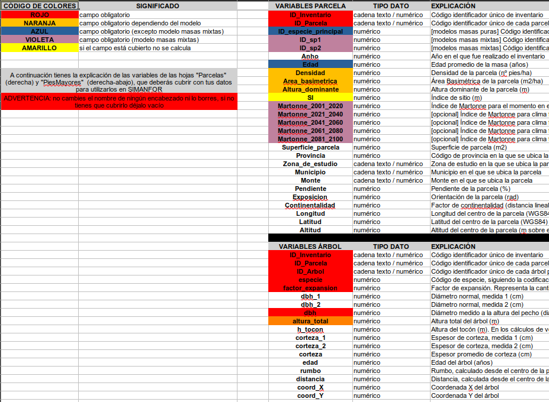
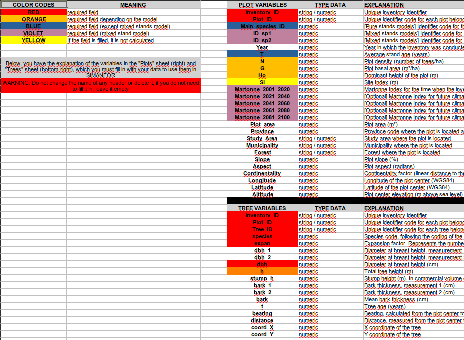

# Plantillas de inventarios para

---

Esta carpeta contiene plantillas de inventario en un formato legible por SIMANFOR. Además, cada plantilla está preparada para ayudar al usuario a autorrellenar algunos campos de información.

:1234: :evergreen_tree: :deciduous_tree: Los códigos de las distintas especies forestales que se utilizan en SIMANFOR puedes encontrarlos en [este archivo](../recursos/IFN4_codigos_especies.csv).

:bulb: Las plantillas están preparadas en inglés y español con los nombres de columnas necesarios para que la simulación funcione correctamente, y se ha indicado con un código de colores los campos que han de ser rellenados según el caso de uso. Además, se ha rellenado la plantilla con datos para dos tipos de modelos, el modelo *Masas mixtas de España* (*datos_masas_mixtas*) y *Ppinaster Sistema Ibérico Meridional - IBEROPT* (*datos_Ppinaster_IBEROPT*), ilustrando así dos ejemplos de uso. Recuerda que en la carpeta [ejemplos](../ejemplos/) tienes un inventario de ejemplo para cada modelo disponible en SIMANFOR.

---

### :file_folder: Contenido:

* :es: :floppy_disk: ***plantilla_inventario_SIMANFOR-ES***: plantilla de inventario para los modelos de SIMANFOR (versión en español). :warning: **ATENCIÓN**, antes de crear tu propio escenario lee las instrucciones que encontrarás en la hoja de *Metadatos* detenidamente, ahí encontrarás qué campos has de cubrir según el modelo a utilizar y qué significa cada campo:

* 🇬🇧 :floppy_disk: ***SIMANFOR_inventory_template-EN***: *inventory template for SIMANFOR models (English version)*. :warning: **WARNING**, before creating your own scenario read the instructions in the *Metadata* sheet carefully, you will find there which fields you have to cover according to the model you are using and what each field means:

*   :open_file_folder: ***Cladanifer***: plantilla de inventario preparada para el modelo de *Cistus ladanifer*, dado que necesita una serie de datos específicos

---

## :email: Contacto

*Para cualquier duda o sugerencia puedes contactar con el equipo técnico de SIMANFOR en simanfor.forest@uva.es*.

---

<h1 align="center" >

[*Inventarios de datos en SIMANFOR*](https://github.com/simanfor/inventarios) - [*Página web de SIMANFOR*](https://www.simanfor.es/)

</h1>

